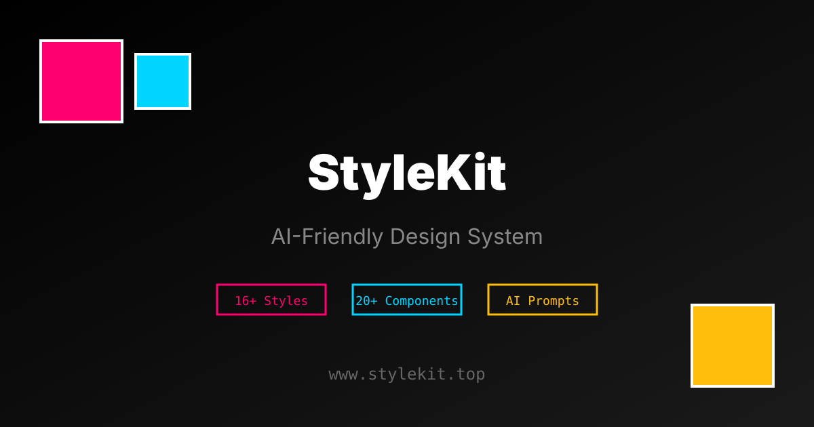

<div align="center">



# StyleKit

**The AI-Friendly Design System — 90+ Styles, 20+ Templates, One Toolkit**

[](https://www.stylekit.top)

<br />

[](https://nextjs.org)
[](https://react.dev)
[](https://tailwindcss.com)
[](https://www.typescriptlang.org)
[](https://supabase.com)
[](LICENSE)

[Features](#features) &bull; [Quick Start](#quick-start) &bull; [Styles](#styles) &bull; [Templates](#templates) &bull; [API](#api) &bull; [AI Integration](#ai-integration) &bull; [Contributing](#contributing)

</div>

---

StyleKit is a comprehensive design system toolkit that helps both humans and AI generate consistent, high-quality UI code. It provides structured style specifications, design tokens, component recipes, prompt templates, and export tools — everything needed to go from "I want a glassmorphism SaaS dashboard" to production-ready frontend code.

## Features

### Core Design System

- **90+ Visual Styles** — From Neo-Brutalist to Glassmorphism, Cyberpunk Neon to Wabi-Sabi, covering modern, retro, artistic, and layout patterns
- **20+ Page Templates** — Production-ready layouts: SaaS landing, admin panel, e-commerce, portfolio, blog, auth pages, and more
- **25+ UI Components** — Built on Radix UI with full accessibility support, including brutalist and neumorphism variant libraries
- **Design Tokens** — Export as CSS variables, Tailwind presets, Figma tokens, shadcn themes, or IDE config files

### AI-Powered Tools

- **Prompt Builder** — Generate structured AI prompts using the three-element framework (Surface, Context, Constraints)
- **Smart Recommender** — Context-aware design suggestions based on audience, device, mood, and brand
- **Style Linter** — Validate code against specific design style rules via CLI, API, or CI/CD
- **Style Analyzer** — Match existing code to the closest StyleKit style
- **Style Blender** — Mix multiple styles with adjustable weights

### Creative Tools

- **Code Playground** — Live editor with CodeMirror, instant preview, and built-in linting
- **Style Creator** — Build custom styles with color, typography, and border controls
- **Style Comparison** — Side-by-side visual and token diff between any two styles
- **Design System Generator** — Generate complete design systems from style selections

### Platform

- **GitHub OAuth** — User authentication via Supabase
- **Ratings & Comments** — Community feedback on styles
- **Style Submissions** — Submit and review community styles
- **Favorites** — Save and sync favorite styles
- **Bilingual (EN/ZH)** — Full internationalization support
- **PWA** — Installable with offline support via service worker
- **Dark / Light Mode** — Theme switching via next-themes

## Quick Start

```bash
git clone https://github.com/AnxForever/stylekit.git
cd stylekit

# Install dependencies (project uses pnpm)
pnpm install

# Start development server
pnpm dev
```

Visit [http://localhost:3000](http://localhost:3000)

### Optional: Supabase Setup

To enable auth, ratings, and comments, create a `.env.local`:

```env
NEXT_PUBLIC_SUPABASE_URL=https://your-project.supabase.co
NEXT_PUBLIC_SUPABASE_ANON_KEY=your-anon-key
SUPABASE_SERVICE_ROLE_KEY=your-service-role-key

# Recommended for production admin access control
ADMIN_USER_IDS=uuid-1,uuid-2

# Optional token for server-to-server admin API calls
ADMIN_API_TOKEN=replace-with-a-long-random-secret

# Optional local audit retention window (days, default 90)
ADMIN_AUDIT_RETENTION_DAYS=90

# Optional CSV export cap for admin audit download (rows, default 5000)
ADMIN_AUDIT_EXPORT_MAX_ROWS=5000

# Optional extra trusted origins for state-changing API routes
# (comma-separated, same-origin is already trusted by default)
CSRF_TRUSTED_ORIGINS=https://admin.stylekit.top
```

## Styles

90+ styles organized across multiple categories:

| Category | Examples |
|----------|---------|
| **Modern / Tech** | Glassmorphism, Neumorphism, Bento Grid, Liquid Glass, Fluent Design |
| **Brutalist** | Neo-Brutalist, Neo-Brutalist Playful, Neo-Brutalist Soft |
| **Brand-Inspired** | Apple Style, Notion Style, Stripe Style |
| **Retro / Vintage** | Art Deco, Vaporwave, VHS Aesthetic, Y2K, Outrun |
| **Artistic** | Watercolor, Impressionist Oil, Pop Art, Risograph, Surrealism |
| **Japanese / Anime** | Ghibli Style, Cyber Anime, Shoujo Manga, Visual Novel, Ukiyo-e |
| **Cyberpunk** | Cyberpunk Neon, Neon Samurai, Sci-Fi HUD, Mecha |
| **Layout Patterns** | Magazine Grid, Masonry Flow, Split Screen, Parallax Sections |
| **Nature / Cozy** | Cottagecore, Scandinavian, Wabi-Sabi, Natural Organic |

[Browse all styles](https://www.stylekit.top/styles)

## Templates

20 production-ready page templates:

| Template | Style |
|----------|-------|
| SaaS Landing | Modern Gradient |
| Admin Panel | Corporate Clean |
| E-commerce Product | Glassmorphism |
| Portfolio Gallery | Bento Grid |
| Editorial Blog | Editorial |
| Auth Pages | Neumorphism |
| Dashboard Charts | Dark Mode |
| Docs Site | Notion Style |
| Pricing Page | Stripe Style |
| Magazine Landing | Swiss Poster |

[Browse all templates](https://www.stylekit.top/templates)

## API

RESTful API for programmatic access to the entire design system:

```http
# Styles
GET    /api/styles                    # List all styles
GET    /api/styles/{slug}             # Full style pack
GET    /api/styles/{slug}/tokens      # Design tokens
GET    /api/styles/{slug}/recipes     # Component recipes
POST   /api/styles/{slug}/rate        # Rate a style
GET    /api/styles/{slug}/comments    # Style comments

# AI / Knowledge
GET    /api/knowledge/search?q=...    # Search design knowledge
GET    /api/knowledge/smart           # Smart recommendations
GET    /api/knowledge/domains         # Knowledge domains
GET    /api/knowledge/stacks          # Tech stack guidelines

# Tools
POST   /api/lint                      # Lint code against style
POST   /api/accessibility             # Accessibility scoring
POST   /api/analyze-style             # Analyze existing style
POST   /api/match-style               # Match to closest style
POST   /api/generate/design-system    # Generate design system

# Export
GET    /api/styles/{slug}/claude-rules    # Export as Claude rules
GET    /api/styles/{slug}/cursorrules     # Export as .cursorrules
GET    /api/styles/{slug}/skill-pack      # Export as skill pack
GET    /api/styles/{slug}/md              # Export as Markdown

# Admin (requires admin session or ADMIN_API_TOKEN)
GET    /api/analytics/dashboard           # Admin analytics dataset
GET    /api/admin/audit                   # Admin action audit events
GET    /api/submit/list                   # Review queue
GET    /api/submit/{id}                   # Submission detail
POST   /api/submit/{id}/review            # Approve/reject submission
```

Audit query params:
- `limit` (1-100), `offset` (>=0)
- `action` (`submission.approve` / `submission.reject`)
- `days` (e.g. `1`, `7`, `30`)
- `search` (slug / actor / target / ID keyword)
- `format=csv` (export filtered logs)
  - CSV cells are formula-safe escaped
  - Export row count is capped by `ADMIN_AUDIT_EXPORT_MAX_ROWS`

For server-to-server admin calls, pass:

```http
Authorization: Bearer <ADMIN_API_TOKEN>
# or
x-admin-token: <ADMIN_API_TOKEN>
```

Security note: state-changing endpoints (`POST`/`PUT`/`PATCH`/`DELETE`) validate request `Origin` and reject untrusted cross-origin calls.

[Full API docs](https://www.stylekit.top/developers/api)

## AI Integration

### MCP Server

StyleKit ships with a [Model Context Protocol](https://modelcontextprotocol.io) server for direct AI assistant integration:

```json
{
  "mcpServers": {
    "stylekit": {
      "command": "npx",
      "args": ["tsx", "/path/to/stylekit/tools/mcp/server.ts"]
    }
  }
}
```

9 tools available: `search_knowledge`, `smart_recommend`, `get_style`, `list_styles`, `lint_code`, `get_stack_guidelines`, `compose_styles`, `generate_context_file`, `analyze_project_style`

### CLI

```bash
pnpm run cli -- lint src/app.tsx --style glassmorphism
pnpm run cli -- recommend --audience developers --mood professional
pnpm run cli -- export neo-brutalist --format tailwind-preset
pnpm run cli -- accessibility cyberpunk-neon
pnpm run cli -- compare glassmorphism neumorphism
```

### llms.txt

AI-discoverable documentation at [`/llms.txt`](https://www.stylekit.top/llms.txt) and `/llms-full.txt`.

### IDE Export Formats

Export any style as: `.cursorrules`, `claude-rules`, `windsurf-rules`, `tailwind-preset`, `shadcn-theme`, `figma-tokens`, `skill-pack`

## Tech Stack

| Layer | Technology |
|-------|-----------|
| Framework | Next.js 16 + Turbopack |
| UI | React 19, Radix UI, Lucide Icons |
| Styling | Tailwind CSS 4, CVA |
| Auth & DB | Supabase (OAuth, PostgreSQL) |
| Editor | CodeMirror 6 |
| Validation | Zod 4 |
| Data Fetching | SWR 2 |
| Analytics | Vercel Analytics |
| Testing | Vitest + Playwright |
| AI Protocol | MCP SDK |

## Project Structure

```
app/                    # Next.js App Router
  ├── styles/           #   90+ style pages + showcases
  ├── templates/        #   20 page templates
  ├── api/              #   REST API endpoints
  ├── admin/            #   Admin dashboard
  ├── developers/       #   Developer portal
  ├── playground/       #   Live code editor
  ├── compare/          #   Style comparison
  ├── blend/            #   Style blender
  └── ...               #   Other pages
components/             # React components
  ├── ui/               #   25+ base components + variants
  ├── styles/           #   Style-specific components
  └── layout/           #   Layout components
lib/                    # Framework-agnostic logic
  ├── styles/           #   Style definitions & tokens
  ├── knowledge/        #   Design knowledge base
  ├── auth/             #   Supabase auth
  ├── export/           #   Export formatters
  └── ...               #   Other modules
tools/                  # Developer tooling
  ├── cli/              #   CLI entry point
  ├── mcp/              #   MCP server
  └── scripts/          #   Build & dev scripts
tests/                  # Test suites
  ├── unit/             #   Vitest unit tests
  └── e2e/              #   Playwright E2E tests
docs/                   # Documentation
public/                 # Static assets
```

## Commands

```bash
pnpm dev                # Development server
pnpm build              # Production build
pnpm start              # Serve production build
pnpm lint               # ESLint
pnpm test               # Unit tests (Vitest)
pnpm e2e                # E2E tests (Playwright)
pnpm run cli            # CLI tool
pnpm run mcp            # MCP server
pnpm run security:secrets   # Secret leak scan
```

## Contributing

Contributions are welcome! Please read the following before opening a PR:

1. [`docs/AGENTS.md`](docs/AGENTS.md) — AI contribution contract and repository guidelines
2. [`docs/CONTRIBUTING.md`](docs/CONTRIBUTING.md) — Contribution guide
3. [`docs/STYLE_ADDITION_CHECKLIST.md`](docs/STYLE_ADDITION_CHECKLIST.md) — Required for new styles

```bash
# Fork & clone
git checkout -b feat/your-feature

# Make changes, then validate
pnpm lint
pnpm test
pnpm build

# Commit with conventional format
git commit -m "feat: add your feature"
git push origin feat/your-feature
# Open PR on GitHub
```

## License

MIT License — see [LICENSE](LICENSE) for details.

---

<div align="center">

**[stylekit.top](https://www.stylekit.top)**

Built by [AnxForever](https://github.com/AnxForever)

</div>
