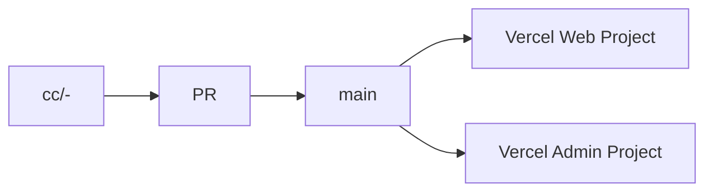

# Admin Independence Roadmap

This document defines how StyleKit isolates admin development while keeping a single release branch (`main`).

## Why this change

Long-lived environment branches (`admin`, `dev`) combined with multiple AI agents introduce frequent drift:

- Features are fixed in one branch but missing in another.
- Cherry-picks cause conflicts and partial migrations.
- Vercel deploy targets become branch-coupled instead of app-coupled.

## Target model (recommended)

- Keep one canonical integration branch: `main`.
- Use short-lived task branches only (`cc/<scope>-<task>`).
- Use separate Vercel projects by **root directory**, not by branch:
  - Web project -> root `apps/web` (future)
  - Admin project -> root `apps/admin` (future)
- Shared code goes to `packages/shared` (future).

## Migration phases

### Phase 0 (now): workflow isolation

- Stop using long-lived `admin` branch for daily work.
- Create task worktrees from `main`:
  - `bash tools/scripts/new-cc-worktree.sh admin <task>`
  - `bash tools/scripts/new-cc-worktree.sh web <task>`
- Merge every completed task back into `main`.

### Phase 1: code ownership boundaries

Move admin domain logic under explicit boundaries while still in one Next app:

- Admin UI: `app/admin/**`
- Admin API: `app/api/admin/**`
- Admin domain: `lib/admin/**`, `lib/auth/admin-*`

Add ownership and checklist rules so AI agents do not mix admin/web changes in one PR.

### Phase 2: app split (when ready)

Split into workspace apps:

- `apps/web`
- `apps/admin`
- `packages/shared`

Then point two Vercel projects to `main` with different root directories.

## Exit criteria

You can consider admin fully isolated when all are true:

1. Admin deploy no longer depends on a dedicated branch.
2. Admin and web can deploy independently from the same commit on `main`.
3. PRs consistently map to one scope (`admin` or `web`) with explicit ownership.
